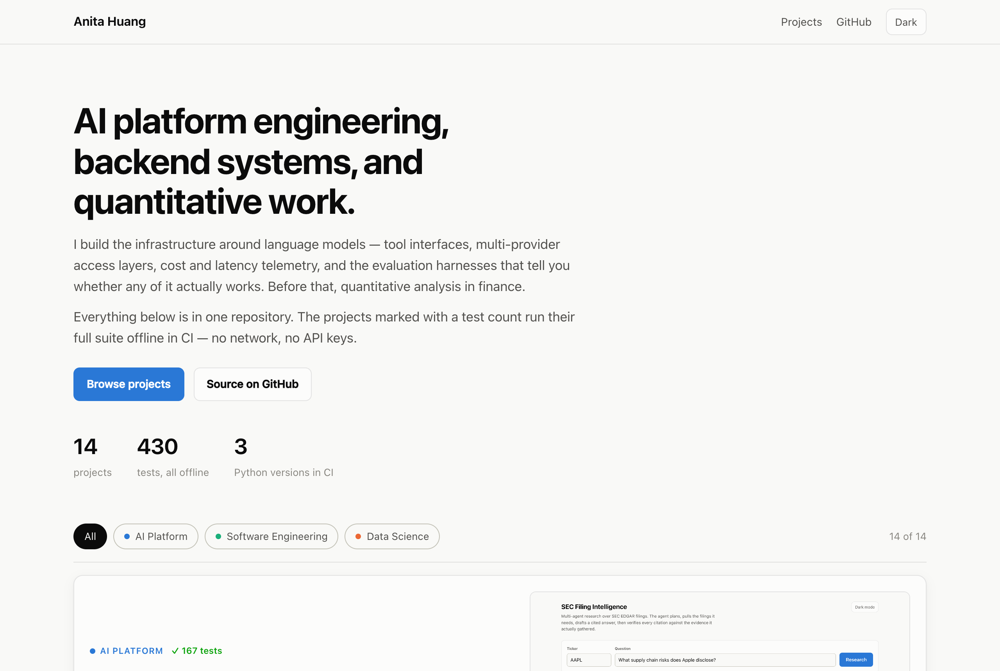

# Anita Huang — Projects

**[View the project site →](https://anita-huangz.github.io/)**

[](https://anita-huangz.github.io/)

AI platform engineering, backend systems, and quantitative work. Everything
here lives in one repository, and every project marked ✅ runs its full test
suite offline in [CI](.github/workflows/ci.yml) — no network, no API keys —
across Python 3.11, 3.12, and 3.13.

**839 tests** — 754 in Python, 85 cross-checking the site's TypeScript ports
against fixtures the Python generated. I've noted what each project gets wrong
as well as what it does, because the bugs are usually the more interesting
half.

---

## AI Platform

### ✅ [SEC Filing Intelligence](ai-platform-projects/sec-filing-intelligence) · 176 tests

Ask a question about a public company and get an answer with every claim cited
to a specific SEC filing — then independently verified against the evidence that
produced it. Served as **both an HTTP API and an MCP server**.

**In** — a ticker and a plain-English question: `AAPL`, *"What supply chain
risks does Apple disclose?"*
**Out** — a cited answer plus structured findings, each carrying an accession
number and filing date, a verified/unverified verdict, and the run's token
count, dollar cost, and latency.

The agent writes a research plan, then calls up to four tools against SEC
EDGAR — listing filings, pulling a named section out of a 10-K, fetching
reported XBRL figures, measuring the price move after a filing date. A separate
verifier pass re-reads the gathered evidence and checks each citation actually
supports its claim before the answer is returned.

```
plan ─▶ research ⇄ tools ─▶ analyze ─▶ verify
```

- **Multi-provider model access** — Anthropic, AWS Bedrock, and a deterministic
  replay provider behind one interface. Nothing above the provider layer imports
  a vendor SDK, which is what lets CI exercise the whole agent graph with no key
  and no spend.
- **Citations are audited, not trusted** — a verifier node checks each finding
  against gathered evidence and can mark the answer unverified.
- **Bounded execution** — a hard tool-call ceiling plus least-privilege
  capability grants. Tools outside a grant are hidden from the model *and*
  refused if it asks anyway.
- **Telemetry** — tokens, estimated USD, latency percentiles, and failure kinds,
  sliced by model and tool. Cached reads bill at 0.1× the *input* rate, which is
  the usual way cost tables overstate spend.
- **Evaluation harness** — accuracy, consistency, reliability, latency, and cost
  measured separately, because they fail independently.
- **A React UI** that streams the agent's run over server-sent events as it
  happens.

`make demo` runs the whole stack against real SEC EDGAR with **no API key**.

**Python · FastAPI · MCP · Pydantic · LangGraph · Claude · AWS Bedrock · Redis ·
Docker · React · TypeScript**

---

## Software Engineering

Ordered by engineering complexity — interacting subsystems, algorithmic depth,
and how much the correctness depends on domain reasoning. Not line count: the
last entry is the smallest project here and also the subtlest, and the one
above it has the most tests.

### ✅ [Factor Portfolio Simulator](software-engineer-projects/factor-based-portfolio-simulator) · 70 tests

Point-in-time backtest of cross-sectional equity factor strategies, with
Fama-French 3-factor attribution — reported **against a benchmark**, because a
backtest that only quotes its own return cannot answer the first question
anyone asks.

Fixed a **look-ahead bias that overstated total return by 92 percentage
points** — factors were computed once from the entire sample and reused at
every rebalance, so the 2021 allocation was picked using 2024 returns.
[`examples/lookahead_demo.py`](software-engineer-projects/factor-based-portfolio-simulator/examples/lookahead_demo.py)
reproduces both loops over identical prices:

| | point-in-time | full-sample (bug) |
|---|---:|---:|
| total return | 2.85% | **95.43%** |
| Sharpe | 0.14 | **1.42** |

The report now carries beta, annualised alpha, tracking error, information
ratio and up/down capture against SPY; drawdown *periods* with peak, trough
and recovery dates, since a single max-drawdown number says nothing about time
underwater; and turnover annualised from the real rebalance cadence, so the
transaction costs it was already charging finally appear in the output. It also
flags the way a factor backtest flatters itself: the default strategy beats SPY
by 234 points while carrying 1.38× its market exposure, and says so.

**Python · pandas · NumPy · statsmodels · yfinance**

### ✅ [Trie Search](software-engineer-projects/web-crawler-and-search-engine) · 77 tests

Crawls a website, indexes every word into a trie, searches by prefix or
single-character wildcard — and **ranks** the results with BM25.

The index used to map each word to the *set* of pages containing it and return
that set alphabetically. That is retrieval without ranking: a page mentioning
"park" once and a park directory mentioning it nineteen times were
indistinguishable, and a two-word query had no way to prefer pages matching
both. BM25 needs three things the set could not provide — term frequency, page
length, and how many pages hold the term at all.

The subtle part is the IDF floor. Without `max(idf, 0)`, a term appearing on
more than half the pages scores *negative*, and a page improves its rank by
**not** matching the query.

`Trie.__iter__` yielded `(key, value)` tuples — and since `MutableMapping`
builds `keys()`, `values()`, and `items()` on top of `__iter__`, all three
raised and `dict(trie)` didn't work. The class claimed a contract it failed.

**Python · httpx · lxml · data structures**

### ✅ [Course Catalog & Scheduling](software-engineer-projects/course-catalog-scheduling-system) · 145 tests

Reads the **live** MPCS catalog at
[mpcs-courses.cs.uchicago.edu](https://mpcs-courses.cs.uchicago.edu/) for any
quarter back to 2015-16, and **builds** a schedule rather than only checking
one. Filtering answers "what still fits?" The question a student asks is the
reverse: given these courses I need and these hours I refuse, what are my
options? That's a search.

The bundled CSV was a snapshot, so it went stale the moment the department
published a new quarter. Going live surfaced three things about the real
listing, each of which cost a wrong guess first — two weekly meetings are one
table cell split by `<br/>`, minutes are omitted when they're zero (the time
parser used to *reject* `6pm`, with a test asserting it), and **a quarter is
published before its times are set.** That last one breaks the solver:

> A course with no meeting time conflicts with nothing, occupies no day and
> leaves no gap — so it scores **zero**, which beats every real timetable. Left
> in, the "best schedule" for a partly-published quarter is the one that
> schedules nothing at all.

Winter 2026-27 is in exactly that state: thirty courses, no times. Unplaceable
courses are now excluded by default, the count is reported, and they stay
searchable.

Sections turned out to be the interesting part. `MPCS 55001-1` and
`MPCS 55001-2` are the same Algorithms course at two different times, so they
deliberately *don't* overlap — and `build_schedule`, which checked only times,
happily enrolled you in Algorithms twice under two different instructors.

The solver is branch-and-bound over sections, scoring preferences in one
interpretable unit — minutes of annoyance. Gaps are the subtle term: they are
**not** monotone, because inserting a class into an idle afternoon *reduces*
total gap time, so a bound that assumed gaps only grow would prune the
gap-filling schedule, which is usually the best one. On a 164-section catalog
the search goes from 137 seconds to 19 exhaustive, or 0.8s inside a node
budget; a test cross-checks the bound against brute force, because a pruning
bug that loses the optimum still hands you a plausible schedule.

It also reports whether its answer is *proven* optimal. "These are the 5 best"
and "these are the 5 best I had time to find" are different claims.

A meeting is a day plus a **half-open** interval, which is the whole conflict
rule: a class ending at 7:30 and one starting at 7:30 are back to back, not a
conflict. Prefix search was actually *substring* search, so `"530"` matched
`MPCS 53014-1` via digits in the middle of the number.

**Python · csv · interval logic**

### ✅ [fastcache](software-engineer-projects/performance-optimization) · 67 tests

An LRU cache decorator benchmarked against `functools`, plus a general `cached`
decorator with TTL expiry and a choice of eviction policy.

The original called `list.remove` on every cache hit — a linear scan on the one
path a cache exists to make fast. Across cache sizes 128 → 32,768 the
list-based hit path slows **8.7×** while this one stays flat at ~0.45µs.

`lru_cache` answers *has this been computed?* A service needs *has this been
computed recently enough?* Expiry needs no heap: every entry gets the same TTL,
so deadline order is insertion order and the next entry to die is the front of
the dict. An expired entry must not count as a hit — that inflates the number
people judge the cache by — and it still occupies capacity, so eviction takes a
dead entry before a live one.

The project also shipped one eviction policy with no evidence it was the right
one. It now measures LRU against LFU across five access patterns, and
**neither wins everywhere:**

| workload | LRU hit | LFU hit | winner |
|---|---:|---:|---|
| zipf (skewed) | 71.3% | 76.4% | LFU +5 pts |
| uniform (no locality) | 10.1% | 10.1% | tie |
| sequential scan | 0.0% | 0.0% | tie |
| hot set + scans | 14.3% | 24.9% | **LFU +11 pts** |
| shifting hot set | 96.4% | 10.7% | **LRU +86 pts** |

LFU keeps a stable hot set that scans would flush out of an LRU. But when the
hot set *moves*, the old keys carry counts the new ones can't reach — so a new
key is the least frequently used thing in the cache and is evicted immediately,
never cached at all. There's no decay, so it's permanent, and the benchmark
shows what that costs rather than hiding it.

**Python · threading · benchmarking**

### ✅ [Card Game](software-engineer-projects/card-game-system) · 114 tests

A single-player poker-style draw game — now with straights, and with an advisor
that tells you what to throw away.

**Straights were missing entirely,** which in a seven-card game is not a small
omission: a straight is *more likely* than a flush, so hands that should have
scored were scoring nothing and ending the run. Detecting one in seven cards
needs duplicates collapsed first (a pair inside the run otherwise reads as a
gap) and the ace valued at both ends without wrapping, so `A 2 3 4 5` counts
and `K A 2 3 4` doesn't. Straight flushes are checked **per suit**, because
"has a straight and has a flush" is a different question — `5♥ 6♦ 7♥ 8♠ 9♥ K♥
2♥` holds both and is neither.

The game used to ask for discards and give the player nothing to decide with.
The advisor values all 120 legal discards, enumerating exactly where that's
cheap (45 draws for one card, 990 for two) and sampling above it — and says
which. Options within combined sampling error of the leader are reported as
tied rather than ranked, because printing them 1st and 2nd would be reporting
noise as a finding.

Two earlier scoring bugs, both from testing for an *exact* count in a
seven-card hand: six- and seven-card flushes scored as nothing, and two triples
scored as three-of-a-kind rather than a full house.

**Python · rich · OOP**

### ✅ [Earnings Drift Tracker](software-engineer-projects/earnings-drift-tracker) · 47 tests

Measures post-earnings-announcement drift against the size of the analyst
surprise — **as abnormal return**, not raw return, because a stock that rose 2%
in a week the market rose 2% did not drift.

Across 8 companies and 311 announcements the raw 10-day drift is +1.43% and the
market-adjusted drift is **+0.43%** — two thirds of the apparent effect was
just the market. The top-minus-bottom surprise quintile spread is +3.33%
(t = +2.18), significant but **not monotonic**, and the report says so rather
than quoting only the spread.

Announcements landing on a non-trading day now fall back to the prior session's
close; requiring an exact index match silently dropped a large and non-random
slice of events.

**Python · pandas · NumPy · REST APIs**

## Data Science

Ordered by complexity, most involved first: depth of method, how much domain
reasoning the result rests on, and how easy it is to get quietly wrong. The
first one is an engineered, tested package; the rest are still exploratory
notebooks.

### 1. ✅ [Customer Churn Prediction](data-science-projects/customer-churn-prediction) · 58 tests
Telco churn treated as what it actually is: **right-censored survival data
driving a spending decision**, not a binary score. 73.5% of these customers
hadn't left when the data was cut, so their lifetime is *at least* their
current tenure — and a classifier reads a one-month customer who stayed and a
six-year customer who stayed as the same row.

Kaplan-Meier, the log-rank test and Cox regression are implemented from
scratch and checked against statsmodels to 1e-8. **The median lifetime is
undefined, and that's the right answer** — more than half are still
subscribed, so it hasn't happened yet; the restricted mean says 46.8 of the
next 60 months. The Cox model reaches concordance **0.870** against the
classifier's 0.845 AUC, because it can see *when* people left. The
proportional-hazards assumption then fails for 16 of 20 covariates, which is
reported next to the hazard ratios rather than in a footnote.

Three bugs in the original notebook: `roc_curve(y_test_numeric, y_prob)`
referenced a variable assigned nowhere; eleven customers with a blank
`TotalCharges` were filled with the column mean, $2,283, when all eleven have
tenure 0 and the answer is exactly 0; and six one-hot columns were exact
duplicates of another column, leaving the design matrix at rank 21 of 27.

**The finding I didn't expect:** the data leak everyone names was worth
**+0.0002** of AUC. Reporting one lucky 80/20 split as an estimate was worth
**0.017**. And class rebalancing — SMOTE, which the notebook used — changed
the ranking by 0.0001 of AUC while making the probabilities twice too large
(calibration error 0.149 against 0.012). AUC can't see that, and it stops
being harmless the moment the score is multiplied by money:

| same budget of 1,000 calls | net |
|---|---:|
| rank by probability × value | **$61,496** |
| rank by probability | $46,317 |
| call everyone | $5,602 |
| call at random | $1,172 |

Ranking by value needs to know how long each customer *would* have stayed —
the area under their own survival curve, which a classifier cannot produce.
**Python · NumPy · pandas · scikit-learn · statsmodels (tests only)**

### 2. [Stock-Bond Portfolio Optimisation](data-science-projects/stock-bond-portfolio-analysis)
Allocates across five ETFs by solving a constrained optimisation whose objective
trades variance against Sharpe, swept across twelve risk preferences. At a
Sharpe weight of zero it is pure minimum-variance and holds **100% short
Treasuries**; at the top it takes 21% equities for 4.1% expected return. The
live demo lets you drag that preference and watch the weights, the frontier
position, and the realised NAV all move.
**463 lines, SPY/IWM/TLT/LQD/SHV, 2012–2024** · SciPy, statsmodels, yfinance

### 3. [Bitcoin Price Forecasting](data-science-projects/bitcoin-and-asset-trading)
A stacked LSTM with dropout, trained on rolling 90-day windows cut from 127 MB
of minute-resolution trades resampled to daily bars. **Running the saved model
against a one-line baseline is the finding:** predicting "tomorrow equals
today" scores an RMSE of $1,401; the LSTM scores $22,283 — 16× worse — with
49% directional accuracy, a coin flip. The chart still looks convincing, which
is the trap. A line that tracks a price *level* can carry no information about
its *changes*, and only the change is tradeable.
**TensorFlow, Keras, scikit-learn**

### 4. [Fake News Detection](data-science-projects/fake-news-detection)
TF-IDF over article text, sentiment polarity, and structural metadata, compared
across several classifiers under cross-validation. **The reportable result is
negative, and it is about the data:** every title is `Breaking News N`, every
body is one templated sentence, no feature correlates above 0.03 with the
label, and the fake rate sits near 50% for every source — The Onion and Reuters
alike. The labels look randomly assigned, so no model can beat chance and any
accuracy quoted on this dataset measures nothing.
[Dataset](https://www.kaggle.com/datasets/khushikyad001/fake-news-detection) ·
**4,000 articles** · scikit-learn, XGBoost, TextBlob

### 5. [E-commerce Recommendations](data-science-projects/personalized-recommendations-for-e-commerce)
Joins customer behaviour against a product catalogue across boosting,
ensembles, text features and seasonality. The data undercuts the premise: the
three customer segments barely differ in average order value, so the segment
label carries little signal.
**10,000 customers × 10,000 products** · scikit-learn, XGBoost

### 6. [Cybersecurity Threat Analysis](data-science-projects/global-security-threats)
Six unsupervised methods over a decade of incidents — PCA and t-SNE, K-Means
and DBSCAN, Isolation Forest and Local Outlier Factor. Unsupervised work is
harder to judge than it looks: with no ground truth, a clean separation can be
an artifact of handing the clusterer the same columns the projection used.
**3,000 incidents, 2015–2024, 150 flagged anomalous** · scikit-learn

### 7. [Weather Trends & Forecast](data-science-projects/weather-trends-and-forecast)
Pulls hourly ERA5 reanalysis from the Open-Meteo API, extracts long-run
temperature trends, and projects them forward. Six cities over 75 years:
London warms fastest at **+0.241 °C/decade**, Sydney slowest at +0.100. The
demo notes what the projection is — a straight line extended, not a climate
model — and that year-to-year variation exceeds a decade of trend. One caveat
stated plainly: the project's legislation-influence feature is synthetic.
**3 scripts, ~200 lines** · pandas, scikit-learn, requests

## Data sources

Every analysis links its source in the site's project panel. The datasets:

| Project | Source |
|---|---|
| Churn | [Telco Customer Churn](https://www.kaggle.com/datasets/blastchar/telco-customer-churn) |
| Fake news | [Fake News Detection](https://www.kaggle.com/datasets/khushikyad001/fake-news-detection) |
| Threats | [Global Cybersecurity Threats 2015-2024](https://www.kaggle.com/datasets/atharvasoundankar/global-cybersecurity-threats-2015-2024) |
| E-commerce | [Personalized Recommendations](https://www.kaggle.com/datasets/suvroo/personalized-recommendations-for-e-commerce) |
| Bitcoin | [Bitcoin Historical Data](https://www.kaggle.com/datasets/mczielinski/bitcoin-historical-data) |
| Stock-bond | [Yahoo Finance](https://finance.yahoo.com/), [Kenneth French Data Library](https://mba.tuck.dartmouth.edu/pages/faculty/ken.french/data_library.html), [FRED](https://fred.stlouisfed.org/) |
| Weather | [Open-Meteo ERA5](https://open-meteo.com/en/docs/historical-weather-api) |
| SEC platform | [SEC EDGAR](https://www.sec.gov/edgar/sec-api-documentation), Yahoo Finance |
| Factor sim / drift | [Yahoo Finance](https://finance.yahoo.com/) |
| Course catalog | [UChicago MPCS courses](https://mpcs-courses.cs.uchicago.edu/) |

## Repository layout

```
ai-platform-projects/     the AI platform
software-engineer-projects/   six engineered Python packages
data-science-projects/    exploratory notebooks
site/                     the portfolio site (React + Vite)
.github/workflows/        CI and GitHub Pages deployment
```

Each engineered project is self-contained: its own `pyproject.toml`, its own
test suite, its own README explaining the design decisions and what was wrong
before.

## Running anything locally

Every Python project follows the same shape:

```bash
cd <project>
python3 -m venv .venv && .venv/bin/pip install -e ".[dev]"
pytest -q
ruff check .
```

The portfolio site:

```bash
cd site && npm install && npm run dev
```

## Conventions

- **Pure logic is separated from I/O.** Computation modules don't print, fetch,
  or plot — which is what makes the arithmetic directly testable.
- **Tests run offline.** Network calls are faked at the transport layer
  (`httpx.MockTransport`) and model calls through a replay provider. No test
  needs a key or a connection.
- **Failures are typed and reported, not swallowed.** A bare
  `except: continue` makes a broken run look like an empty one.
- **READMEs state the limits.** Every project has a "notes" or "limits" section
  covering what it doesn't do and where the numbers shouldn't be trusted.
